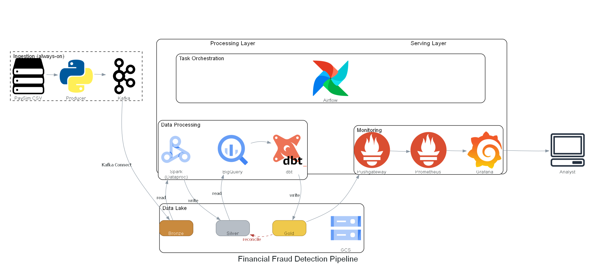
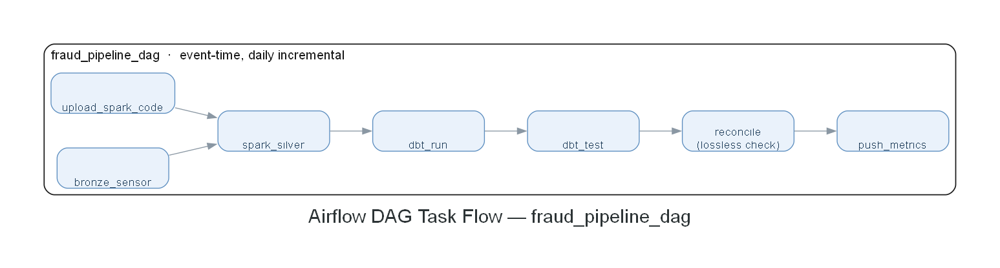

# Financial Fraud Detection Pipeline

PaySim 기반 금융 거래 **엔드투엔드 배치 데이터 파이프라인**. Kafka부터 BigQuery/Grafana까지
완전 자동화된 배치 파이프라인을 GCP 위에서 재현 가능하게 구축한 포트폴리오 프로젝트입니다.

## 핵심

이 프로젝트의 핵심은 **파이프라인 자체의 신뢰성**입니다 — 금융 데이터를 단 1건도 유실·중복 없이
(무손실·무중복·멱등) Bronze→Silver→Gold로 처리하고, 레이어를 넘어갈 때마다 정합성을 자동
검증합니다.

PaySim 데이터셋에는 실제 사기 거래(`isFraud=1`)와, 기존 룰 기반 시스템이 사기라고 미리
플래그를 단 거래(`isFlaggedFraud=1`)가 각각 존재합니다. 이 원본 라벨은 그대로 보존하고,
파이프라인은 이를 이용해 거래 현황·기존 룰의 탐지 성능(precision/recall)·**기존 룰이 놓친
사기**(`isFraud=1 AND isFlaggedFraud=0`)를 집계·가시화합니다. (우리가 새 사기 탐지기를
만드는 것이 아니라, 기존 룰의 성능을 데이터로 신뢰성 있게 분석하는 것이 목표입니다 — 자체
탐지 로직 구현은 스코프 아웃했습니다.)

최종 산출물인 `undetected_fraud` 테이블 건수는 Silver의 `is_suspicious=true` 건수와 정확히
일치해야 하며, 이 등식은 **Silver→Gold 이동 중 데이터가 새거나 겹치지 않았는지**를 검증하는
용도로 파이프라인이 돌 때마다(Airflow `reconcile` 태스크) 자동 확인합니다.

## 무손실 · 무중복 설계

금융 데이터는 단 1건도 유실/중복되면 안 된다는 원칙 아래 전 컴포넌트를 설정했습니다:

- **Kafka**: RF=3, `min.insync.replicas=2`, `unclean.leader.election=false`, 멱등 Producer(`acks=all`)
- **Kafka Connect**: at-least-once 적재(GCS Sink 업로드 성공 후 오프셋 커밋)
- **Spark**: `partitionOverwriteMode=dynamic`(멱등 재처리) + `row_id`(SHA-256) 기반 dedup
- **Airflow**: 재시도(retries=2) + 멱등 태스크 + `max_active_runs=1`
- 금액은 float 드리프트 방지를 위해 전 구간 문자열/decimal로 직렬화

## 아키텍처

### 전체 아키텍처



### 배치 DAG 태스크 플로우



> 다이어그램은 코드로 생성됨(`mingrammer/diagrams`) — 재생성: `python docs/diagrams/generate.py`
> (Graphviz 필요, 상세는 `docs/diagrams/generate.py` 상단 주석 참조)

## 기술 스택

| 역할 | 기술 |
|------|------|
| 메시지 큐 | Apache Kafka (3-broker KRaft, RF=3) |
| 수집 | Kafka Connect (Confluent GCS Sink Connector) |
| 배치 처리 | Apache Spark (Dataproc Serverless) |
| 오케스트레이션 | Apache Airflow (이벤트시간 일별 증분) |
| Data Lake | Google Cloud Storage (Medallion: Bronze) |
| Data Warehouse | BigQuery (Silver/Gold) |
| 데이터 모델링 | DBT (dbt-bigquery) |
| 모니터링 | Prometheus + Pushgateway + Grafana |
| 인프라 | Docker Compose (로컬 오케스트레이션 스택) + GCP(Dataproc/GCS/BigQuery) |
| 언어 | Python |

## 데이터셋

- [PaySim](https://www.kaggle.com/datasets/ealaxi/paysim1) 합성 금융 거래 데이터 — 630만 건
- 컬럼: `step, type, amount, nameOrig, oldbalanceOrg, newbalanceOrig, nameDest, oldbalanceDest, newbalanceDest, isFraud, isFlaggedFraud`
- 사기는 `CASH_OUT`, `TRANSFER` 유형에서만 발생

## Medallion 레이어

| 레이어 | 저장소 | 내용 |
|--------|--------|------|
| **Bronze** | GCS | Kafka 원본 JSON 그대로 + `kafka_timestamp`만 추가. **절대 수정/삭제 금지(append-only)**. `date=YYYY-MM-DD`(인제스트일) 파티션. |
| **Silver** | BigQuery (Dataproc가 GCS→BQ 적재) | 품질검증(null/음수/잘못된 타입 등) + Quarantine 격리(삭제하지 않고 보존) + `is_suspicious` 플래그. |
| **Gold** | BigQuery (DBT) | `hourly_summary`(시간대별 집계) · `undetected_fraud`(기존 룰 미탐지 사기 집계) · `account_risk`(계좌별 위험도). |

## 프로젝트 구조

```
kafka/       # Producer(CSV→Kafka) + Kafka Connect GCS Sink 설정
spark/       # Bronze→Silver 배치(batch_silver.py, Dataproc Serverless 전용)
airflow/     # DAG(bronze_sensor→spark_silver→dbt→reconcile→push_metrics)
dbt/         # Gold 3모델 + 테스트(not_null/unique/accepted_values)
bigquery/    # 외부테이블 DDL(Bronze/Silver)
prometheus/  # Prometheus/statsd 설정
grafana/     # 대시보드 + 프로비저닝
docker/      # docker-compose.yml (Kafka/Airflow/모니터링 오케스트레이션)
tests/       # pytest (DAG 구조·정합성 로직·모니터링)
```

각 디렉토리에는 세부 규칙을 담은 `CLAUDE.md`가 있습니다.

## 실행 방법

### 사전 준비
- Docker Desktop
- GCP 프로젝트 + 서비스 계정 키(GCS/BigQuery/Dataproc 권한) → `credentials/service_account.json`
- `.env.example`을 `.env`로 복사 후 GCP 프로젝트 정보 입력

### 기동
```bash
# 1. Kafka + Airflow 기동
docker compose -f docker/docker-compose.yml up -d

# 2. Kafka Connect (Bronze 수집) 기동
docker compose -f docker/docker-compose.yml --profile connect up -d --build

# 3. 모니터링 스택(선택)
docker compose -f docker/docker-compose.yml --profile monitoring up -d

# 4. 샘플 데이터 발행
python kafka/producer.py --limit 1000

# 5. 파이프라인 실행
docker exec airflow-scheduler airflow dags test fraud_pipeline 2016-01-01
```

## 테스트

```bash
pytest tests/test_airflow_dag.py -v   # DAG 구조/정합성 로직
pytest tests/test_monitoring.py -v    # 모니터링 설정/E2E
```

정합성(레이어 간 무손실·무중복 등식) 검증 절차는 `.claude/skills/verify-reconciliation` 참고.

## 검증 결과 (예시 실행)

- Bronze 1,030,833건 → Silver 574,255건(2016-01-01, dedup 270건 제거) → Gold `undetected_fraud` 890건
- **`undetected_fraud`(890) == Silver `is_suspicious`(890)** — 레이어 간 무손실·무중복 정합성 통과
