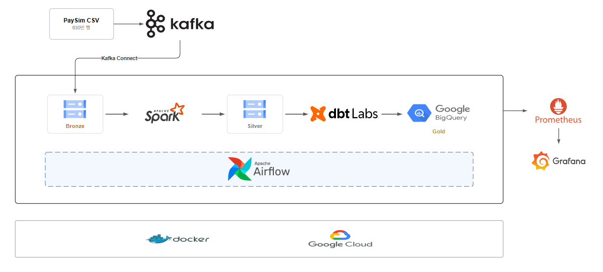
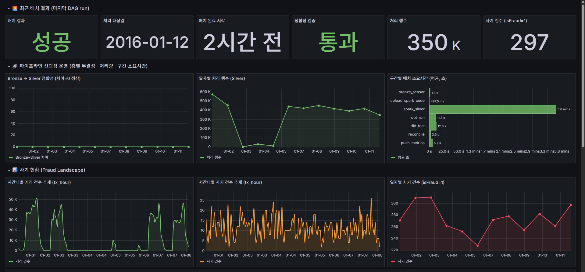

# Financial Fraud Detection Pipeline

PaySim 합성 금융 거래 데이터 630만 건을 Kafka로 수집해 Bronze→Silver→Gold로 처리하는
**엔드투엔드 배치 데이터 파이프라인**입니다. GCP(GCS / BigQuery / Dataproc Serverless) 위에서
재현 가능하게 구축했으며, 집중한 것은 **파이프라인 자체의 신뢰성** — 금융 데이터를 단 1건도
유실·중복 없이 처리하고, 레이어를 넘어갈 때마다 정합성을 자동 검증하는 것입니다.

원본의 사기 라벨(`isFraud` · `isFlaggedFraud`)은 그대로 보존하고, Gold에서 시간·거래유형별
거래량과 사기 건수, 계좌별 사기 비율을 집계하고 기존 룰이 놓친 사기 거래를 따로 추출합니다.
**새로운 사기 탐지 로직을 만드는 것은 스코프가 아닙니다.**

> 설계 판단의 근거와 상세는 **[설계 노트 (docs/DESIGN.md)](docs/DESIGN.md)** 에 정리했습니다.

---

## 아키텍처



| 레이어 | 저장소 | 형식 · 파티션 | 내용 |
|--------|--------|---------------|------|
| **Bronze** | GCS | JSON · `date=YYYY-MM-DD`(이벤트일) | Kafka 원본 그대로 + `kafka_timestamp`. append-only(수정·삭제 금지) |
| **Silver** | GCS | Parquet · `tx_date=YYYY-MM-DD` | 품질검증 통과 행 + `is_suspicious` 파생. 불량 행은 `quarantine/`에 격리 |
| **Gold** | BigQuery | 테이블 (dbt) | `hourly_summary` · `undetected_fraud` · `account_risk` |

Bronze와 Silver는 GCS에 파일로 두고 **BigQuery External Table로 노출**해 복사 없이 SQL로
조회합니다. Gold만 BigQuery 테이블로 실체화됩니다.

수집(CSV→Kafka→Bronze)은 상시 동작하고, Airflow DAG는 **Bronze 이후 배치 구간**만
오케스트레이션합니다. 덕분에 수집 방식을 교체해도 DAG는 영향을 받지 않습니다.

```
bronze_sensor      ─┐
                    ├─→ spark_silver → dbt_run → dbt_test → reconcile → push_metrics
upload_spark_code  ─┘
```

`bronze_sensor`와 `upload_spark_code`는 병렬입니다. 센서가 그날 데이터의 완결 도착을
기다리는 동안 Spark 코드 업로드가 이미 끝나 있으므로, 대기 시간이 낭비되지 않습니다.

DAG 1회 실행 = 이벤트일 하루치(`tx_date`) 증분 처리이며, `catchup`으로 과거 일자를
백필합니다.

---

## 주요 기능

### 수집 완결 판정

`bronze_sensor`는 그날 데이터가 Bronze에 **완결 도착**했을 때만 통과합니다. 판정 기준은
"그날의 EOD 마커 수 == Kafka 토픽 파티션 수"입니다. 완결 신호를 데이터와 같은 경로
(Kafka→Connect→GCS)로 흘려보내야 그 경로의 완료가 증명되기 때문입니다.

→ [왜 시간 대기나 파일 개수가 아닌가](docs/DESIGN.md#수집-완결-판정)

### 품질검증 + Quarantine (무손실)

Spark가 Bronze를 읽어 7종의 품질 조건을 검사하고 `reject_reason`을 부여합니다. 불량 행은
**삭제하지 않고** `silver/quarantine/`에 사유와 함께 격리 보존합니다. Silver External
Table은 `uris`를 `tx_date=*`로 스코프해, 격리 데이터가 애초에 스캔 대상에 들어오지 않습니다.

→ [품질 조건 7종과 경로 스코프](docs/DESIGN.md#품질검증과-quarantine)

### 무손실 · 무중복 설계

전 컴포넌트를 at-least-once(무손실) + 멱등/dedup(무중복) 조합으로 설정했습니다. Kafka
`RF=3`·`min.insync.replicas=2`, 멱등 Producer(`acks=all`), Spark
`partitionOverwriteMode=dynamic` + `dropDuplicates(row_id)`, 금액은 float 드리프트 방지를
위해 `DECIMAL(18,2)`로 직렬화합니다.

→ [컴포넌트별 설정과 그 이유, dedup 키 충돌 검증](docs/DESIGN.md#무손실-무중복-설계)

### 정합성 자동 검증 (reconcile)

매 DAG 실행마다 **Bronze(품질검증 통과 · `row_id` 유니크) 행수 == Silver 행수**를
이벤트일별로 대조하고, 한 날짜라도 어긋나면 DAG를 실패시킵니다. Bronze 쪽 집계는 Spark
코드와 별개로 SQL에 다시 구현해, 한쪽 구현의 버그가 다른 쪽에 가려지지 않게 했습니다.

→ [reconcile 태스크 위치 · 대조 등식 · 3단계 절차](docs/DESIGN.md#정합성-자동-검증)

### 모니터링

Gold/Silver 집계 지표를 Pushgateway로 push하고 Prometheus가 스크랩, Grafana가 시각화합니다.



*2016-01-01 ~ 01-12 (12일치) 처리 후*

최상단 행은 **최근 배치 결과**를 다룹니다 — 배치 결과 · 처리 대상일 · 완료 시각 · 정합성 검증 ·
처리 행수 · 사기 건수. 누적값이 아니라 **그 실행이 처리한 하루치**를 보여주므로, 일별 배치가
정상 처리됐는지 한 화면에서 확인할 수 있습니다.

이어지는 행은 파이프라인 추세(Bronze↔Silver 차이 · 처리량 · 구간별 소요시간), 기존 룰 탐지
성능, 사기 현황, 인프라 헬스 순입니다.

모니터링 스택은 **선택 사항**입니다. Pushgateway가 없으면 `push_metrics` 태스크가 FAILED가
아니라 SKIPPED로 끝나므로, 대시보드가 떠 있지 않다는 이유로 데이터 파이프라인이 죽지 않습니다.

---

## 성능

측정 조건을 고정(전량 630만 건, executor 4개 × 4코어, 동적 할당 off)하고 개선 전후를
비교했습니다.

| 개선 | 지표 | Before | After | 효과 |
|---|---|---|---|---|
| Kafka Connect `flush.size` 1000→10000 | Kafka→Bronze 처리량 | 21,139 행/초 | **38,797 행/초** | **+83.5%** |
| Spark 중복 스캔 제거 | Silver 배치 실행 | 156.0초 | **108.5초** | **−30.5%** |

두 개선의 누적 효과입니다.

```
개선 전   234.5초   27,129 행/초
개선 후   108.5초   58,663 행/초

   시간 −53.7%      처리량 2.16배
```

29회차 측정 전 회차에서 검산 6줄이 일치해 **무손실·무중복을 유지한 상태**의 개선임을
확인했습니다.

→ [측정 방법과 개선 내역](docs/DESIGN.md#성능-최적화)

---

## 기술 스택

| 역할 | 기술 |
|------|------|
| 수집 (발행) | Python Producer (confluent-kafka · 멱등 · `acks=all`) |
| 메시지 큐 | Apache Kafka (3-broker KRaft, RF=3) |
| 적재 (싱크) | Kafka Connect (Confluent GCS Sink Connector) |
| 배치 처리 | Apache Spark (Dataproc Serverless) |
| 오케스트레이션 | Apache Airflow (이벤트시간 일별 증분) |
| Data Lake | Google Cloud Storage (Bronze / Silver) |
| Data Warehouse | BigQuery (External Table + Gold) |
| 데이터 모델링 | dbt (dbt-bigquery) |
| 모니터링 | Prometheus + Pushgateway + Grafana |
| 인프라 | Docker Compose (로컬 컨테이너) + GCP |
| CI/CD | GitHub Actions |
| 언어 | Python |

---

## 프로젝트 구조

```
kafka/        # Producer(CSV→Kafka) + Kafka Connect GCS Sink 설정
spark/        # Bronze→Silver 배치(batch_silver.py, Dataproc Serverless 전용)
airflow/      # DAG(bronze_sensor→spark_silver→dbt→reconcile→push_metrics)
dbt/          # Gold 3모델 + staging view 1개, 테스트(not_null/unique/accepted_values)
bigquery/     # 외부테이블 DDL(Bronze/Silver)
prometheus/   # Prometheus / Pushgateway / statsd 설정
grafana/      # 대시보드 + 프로비저닝
tests/        # pytest (DAG 구조 · 정합성 로직 · 모니터링)
docs/         # 설계 노트 + 아키텍처 다이어그램
docker-compose.yml   # Kafka / Airflow / 모니터링 (루트 — .env 자동 로드)
```

---

## 실행 방법

<details>
<summary><b>전체 실행 절차 펼치기</b> — GCP 프로젝트, 서비스 계정 키, Kaggle 데이터셋이 필요합니다</summary>

### 1. 사전 준비

- Docker Desktop
- GCP 프로젝트 및 `gcloud` CLI
- 서비스 계정 키 → `credentials/service_account.json`
  (필요 권한: GCS 읽기/쓰기, BigQuery 데이터 편집 + 잡 실행, Dataproc 배치 실행)
- PaySim 데이터셋([Kaggle](https://www.kaggle.com/datasets/ealaxi/paysim1)) → `data/raw/`

### 2. GCP 리소스 생성

```bash
export PROJECT_ID=<your-project-id>
export REGION=asia-northeast3

# GCS 버킷 3개
gcloud storage buckets create gs://${PROJECT_ID}-bronze  --location=${REGION}
gcloud storage buckets create gs://${PROJECT_ID}-silver  --location=${REGION}
gcloud storage buckets create gs://${PROJECT_ID}-staging --location=${REGION}

# BigQuery 데이터셋 3개
bq --location=${REGION} mk -d fraud_bronze
bq --location=${REGION} mk -d fraud_silver
bq --location=${REGION} mk -d fraud_gold
```

### 3. 환경 변수 설정

`.env.example`을 `.env`로 복사한 뒤 채웁니다. `.env`는 커밋하지 않습니다.

```bash
cp .env.example .env
```

| 변수 | 설명 |
|------|------|
| `GCP_PROJECT_ID` | GCP 프로젝트 ID (**필수**) |
| `GCP_REGION` | 리전. 기본 `asia-northeast3` |
| `GCS_BUCKET_BRONZE` / `_SILVER` / `_STAGING` | 위에서 만든 버킷 이름 (**필수**) |
| `GCP_SA_EMAIL` | 서비스 계정 이메일 (**필수**) |
| `GCP_CREDENTIALS_PATH` | 키 파일 경로. 기본 `./credentials/service_account.json` |
| `BQ_DATASET_BRONZE` / `_SILVER` / `_GOLD` | BigQuery 데이터셋. 기본 `fraud_bronze` / `fraud_silver` / `fraud_gold` |
| `HOST_PROJECT_DIR` | 프로젝트의 **호스트 기준 절대경로** (**필수**). Airflow가 docker.sock으로 띄우는 형제 컨테이너의 바인드 마운트에 필요. Windows도 슬래시(`/`) 사용 |
| `STEP_EPOCH` | PaySim `step=1`의 절대 시각. 기본 `2016-01-01 00:00:00`. 변경 시 이미 적재된 Silver와 어긋나므로 전량 재처리 필요 |
| `KAFKA_BOOTSTRAP_SERVERS` | 호스트에서 접속할 브로커 목록 |
| `RAW_CSV_PATH` | 원본 CSV 경로 |

미설정 시 `docker-compose.yml`이 즉시 에러를 냅니다(필수 항목은 `:?`로 강제).

### 4. 외부 테이블 생성

DDL 파일은 프로젝트 ID·버킷명을 `${...}`로 두고 있으므로, `.env` 값을 환경변수로 올린 뒤
`envsubst`로 치환해 실행합니다.

```bash
set -a && . ./.env && set +a

envsubst < bigquery/bronze_external_table.sql | bq query --use_legacy_sql=false
```

**Silver 외부 테이블은 첫 파이프라인 실행(7번) 이후에 만듭니다.** 컬럼을 선언하지 않고
Parquet 스키마를 자동 감지하는 구조라, `tx_date=*`에 파일이 하나도 없으면
`matched no files`로 실패합니다.

```bash
envsubst < bigquery/silver_external_table.sql | bq query --use_legacy_sql=false
```

`envsubst`는 Git for Windows(Git Bash)와 대부분의 Linux 배포판에 기본 포함돼 있습니다.
없다면 `gettext` 패키지를 설치하세요. Windows의 Git Bash에서 `bq`가 Python 스텁에 걸려
실패하면 `bq.cmd`로 바꿔 실행합니다.

### 5. 기동

```bash
# Kafka(3-broker) + Airflow + Postgres
docker compose up -d

# Kafka Connect (Bronze 수집)
docker compose --profile connect up -d --build

# 모니터링 스택 (선택)
docker compose --profile monitoring up -d
```

| 서비스 | 주소 |
|--------|------|
| Kafka UI | http://localhost:8080 |
| Airflow | http://localhost:8081 |
| Grafana | http://localhost:3000 (admin/admin) |
| Prometheus | http://localhost:9090 |
| Pushgateway | http://localhost:9091 |

### 6. 데이터 발행

Producer는 컨테이너로 실행합니다. `profile=producer`라 `up`에는 뜨지 않고, 명시적으로
트리거할 때만 동작합니다 — CSV 발행은 자동으로 일어나면 안 되는 작업이기 때문입니다.

```bash
# 스모크 1,000건 (compose 기본 command)
docker compose --profile producer run --rm producer

# 이벤트일 1일치 전량
docker compose --profile producer run --rm producer \
  python producer.py --limit 0 --max-days 1

# 전량 630만 건
docker compose --profile producer run --rm producer \
  python producer.py --limit 0
```

컨테이너 안에서는 브로커 주소(`kafka1:29092,...`)와 CSV 경로가 자동으로 잡히므로 별도
설정이 필요 없습니다.

Producer는 하루치 발행이 끝날 때마다 모든 파티션에 **EOD 마커**를 찍습니다. 이 마커가
`bronze_sensor`의 완결 판정 근거이므로, 발행 없이 DAG를 돌리면 센서가 통과하지 않습니다.

### 7. 파이프라인 실행

Airflow UI(http://localhost:8081)에서 `fraud_pipeline` DAG를 unpause하면 `catchup`이
이벤트일을 순서대로 백필합니다. 이것이 기본 경로입니다.

단일 일자만 확인하려면 스케줄러를 거치지 않고 그 자리에서 실행할 수 있습니다.

```bash
docker exec airflow-scheduler airflow dags test fraud_pipeline 2016-01-01
```

</details>

---

## 데이터셋

- [PaySim](https://www.kaggle.com/datasets/ealaxi/paysim1) 합성 금융 거래 데이터 — 6,362,620행
- 컬럼: `step, type, amount, nameOrig, oldbalanceOrg, newbalanceOrig, nameDest, oldbalanceDest, newbalanceDest, isFraud, isFlaggedFraud`
- `step` 1~743 (2016-01-01 ~ 01-31, 시간 단위)
- `isFraud=1` 8,213건 · `isFlaggedFraud=1` 16건 — 기존 룰이 잡은 건 8,213건 중 16건뿐
- 사기는 `CASH_OUT`, `TRANSFER` 유형에서만 발생
